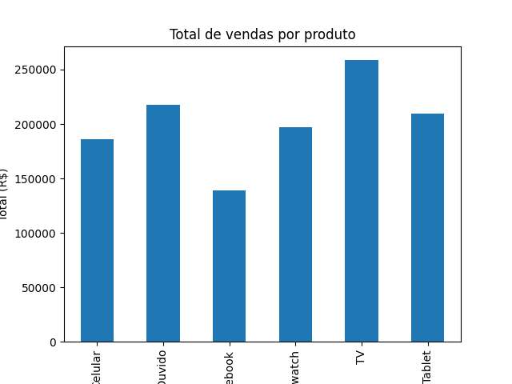

# Análise de Vendas com Python e Pandas

---

## Sobre o projeto

O objetivo deste pequeno projeto é praticar conhecimentos adquiridos em análise de dados, utilizando Python e bibliotecas do seu ecossistema.

---

## Neste notebook/script foram feitas:

- Leitura de um arquivo CSV para análise de dados de vendas  
- Cálculo do total de vendas e comissão  
- Agrupamento de dados por lojas e produtos  
- Análise da frequência de produtos por loja  
- Geração de gráficos de barras e pizza  
- Identificação da data com maior total de vendas  
- Coleta dos dados dos três produtos mais vendidos  

---

## Tecnologias e bibliotecas

- Python  
- Pandas  
- NumPy  
- Matplotlib  

---

## ▶️ Como executar

1. Clone o repositório:

\`\`\`bash
git clone https://github.com/seu-usuario/analise_vendas.git
cd analise_vendas_lojas
\`\`\`

2. Instale as bibliotecas necessárias (recomendo usar ambiente virtual):

\`\`\`bash
pip install pandas numpy matplotlib
\`\`\`

3. Execute o script:

\`\`\`bash
python analise_vendas.py
\`\`\`

---

## Exemplo de gráficos

-   
-   

---

## Dataset

O arquivo de dados utilizado é o \`vendas.csv\`, que contém as seguintes colunas:

- produto  
- quantidade  
- preço unitário  
- loja  
- data da venda  
- total de vendas  

---

## Licença

Este projeto está sob a licença MIT. Veja mais em [LICENSE](./LICENSE).

---

## Autor

João Carlos — [@dev-joao-carlos](https://www.linkedin.com/in/dev-joao-carlos)  
Veja mais projetos em [github.com/rhufy](https://github.com/rhufy)

